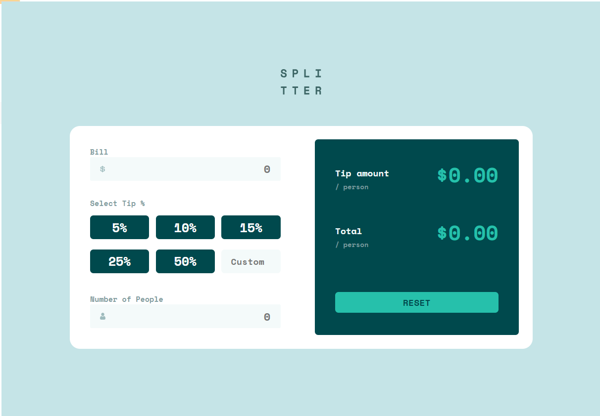
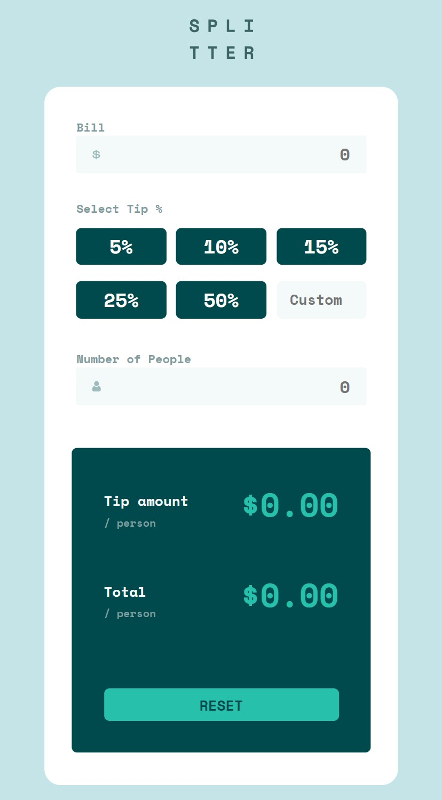

# Proyecto Final Nivel 1 - Calculadora de Propina (FUNVAL)

## Descripción

Para este proyecto estarás creando una calculadora de propina teniendo en cuenta el siguiente requerimiento:

Un cliente te ha contratado para crear un programa para su restaurante. En este local se tiene muy en cuenta el trabajo que realizan los camareros,
por ello los clientes pueden dejar propinas al camarero que les ha atendido considerando un
porcentaje de su consumo total y tambien tomando en cuenta la cantidad de personas
atendidas. El programa debe considerar algunos datos a **INGRESAR** por el personal
que maneja la caja registradora:

- `Bill` que representa el monto total de la cuenta.
- `Select Tip` que indica el porcentaje de propina.
- `Number of People` que indica la cantidad de clientes entre los que se dividirá la cuenta.

Asimismo, el programa debe contemplar los datos de **SALIDA**:

- `Tip Amount (person)` que indica el monto de propina que pagará cada persona.
- `Total (person)` que indica el total que debe pagar cada persona, es decir el monto total de la cuenta más el monto de propina, entre la cantidad de personas `(Bill / NumberOfPeople) + TipXPersona`

## Resultado Renderizado

Teniendo en cuenta la solicitud del cliente, el resultado final es el siguiente:

  
  

## Tecnologías utilizadas

- JavaScript
  - DOM
  - Eventos
  - Funciones
- HTML
- CSS
